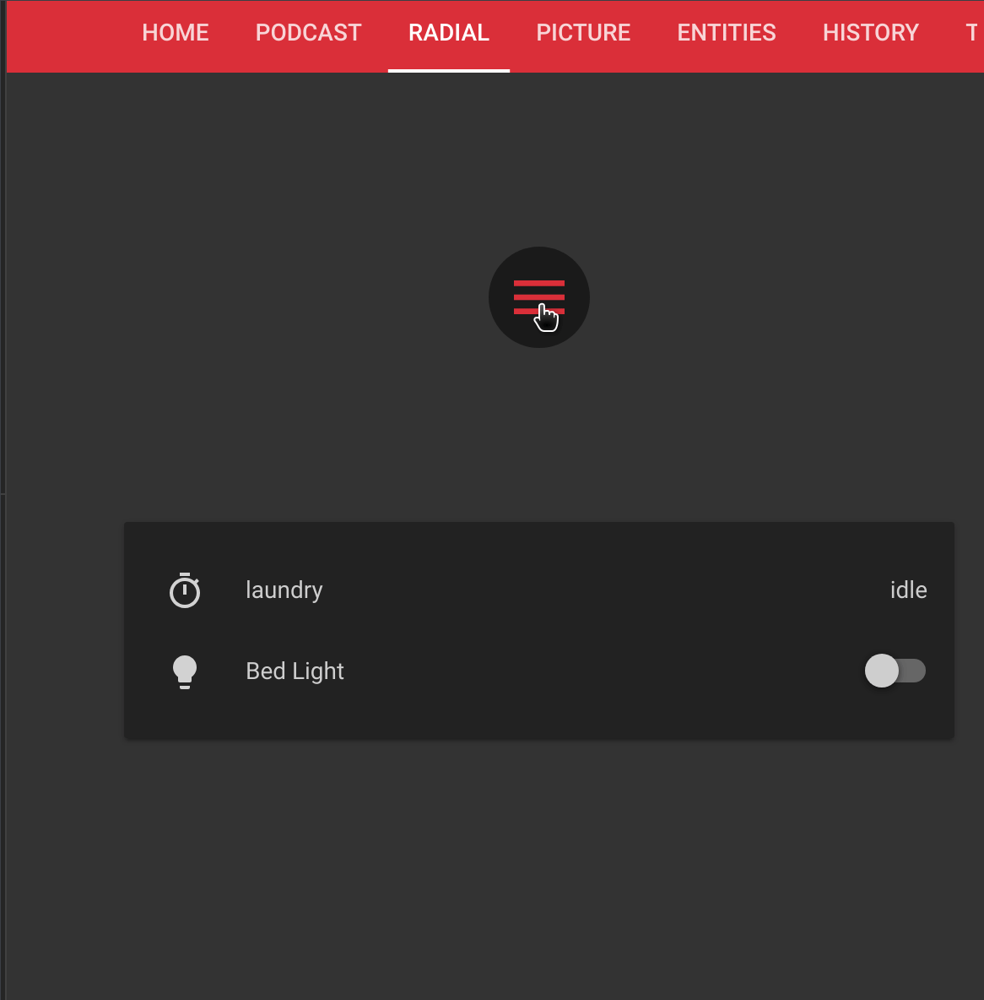

# ⭕ Lovelace Radial Menu Element

[![GitHub Release][releases-shield]][releases]
[![License][license-shield]](LICENSE.md)
[](https://github.com/custom-components/hacs)

![Project Maintenance][maintenance-shield]
[![GitHub Activity][commits-shield]][commits]

[![Discord][discord-shield]][discord]
[![Community Forum][forum-shield]][forum]

[![Twitter][twitter]][twitter]
[![Github][github]][github]

This element is for [Lovelace](https://www.home-assistant.io/lovelace) on [Home Assistant](https://www.home-assistant.io/) that provides a radial menu on click for quick/space saving access to commands. Designed for picture-elements, but can be used anywhere.

## Minimum Home Assistant Version

Home Assistant version 0.110.0 or higher is required as of release 1.2.0 of restriction-card

## Support

Hey dude! Help me out for a couple of :beers: or a :coffee:!

[](https://www.buymeacoffee.com/zJtVxUAgH)



## Installation

Use [HACS](https://hacs.xyz) or follow this [guide](https://github.com/thomasloven/hass-config/wiki/Lovelace-Plugins)

```yaml
resources:
  url: /local/radial-menu.js
  type: module
```

## Options

| Name                | Type      | Requirement  | Description                                                               | Default               |
| ------------------- | --------- | ------------ | ------------------------------------------------------------------------- | --------------------- |
| `type`              | `string`  | **Required** | `custom:radial-menu`                                                      | `none`                |
| `items`             | `list`    | **Required** | List of items to display in the radial. See [item options](#item-options) | `none`                |
| `name`              | `string`  | **Optional** | Tooltip for main menu                                                     | `Menu`                |
| `icon`              | `string`  | **Optional** | mdi icon for main menu                                                    | `mdi:menu`            |
| `entity_picture`    | `string`  | **Optional** | picture to display                                                        | `none`                |
| `default_open`      | `boolean` | **Optional** | Should the radial be expanded on first load                               | `false`               |
| `default_dismiss`   | `boolean` | **Optional** | Should the radial be dismissed on click                                   | `true`                |
| `entity`            | `string`  | **Optional** | Home Assistant entity ID (used for `more-info` action)                    | `none`                |
| `tap_action`        | `map`     | **Optional** | Action to take on tap. See [action options](#action-options)              | `action: toggle-menu` |
| `hold_action`       | `map`     | **Optional** | Action to take on hold. See [action options](#action-options)             | `none`                |
| `double_tap_action` | `map`     | **Optional** | Action to take on double tap. See [action options](#action-options)       | `action: none`        |
| theme               | `string`  | **Optional** | Card theme                                                                |

## Item Options

| Name                | Type     | Requirement  | Description                                                         | Default             |
| ------------------- | -------- | ------------ | ------------------------------------------------------------------- | ------------------- |
| `card`              | `string` | **Optional** | A whole other Lovelace card configuration to build.                 |
| `entity`            | `string` | **Optional** | Home Assistant entity ID.                                           | `none`              |
| `name`              | `string` | **Optional** | Tooltip for main menu                                               | `Menu`              |
| `icon`              | `string` | **Optional** | mdi icon for main menu                                              | `none`              |
| `entity_picture`    | `string` | **Optional** | picture to display                                                  | `none`              |
| `tap_action`        | `map`    | **Optional** | Action to take on tap. See [action options](#action-options)        | `action: more-info` |
| `hold_action`       | `map`    | **Optional** | Action to take on hold. See [action options](#action-options)       | `none`              |
| `double_tap_action` | `map`    | **Optional** | Action to take on double tap. See [action options](#action-options) | `action: none`      |

## Action Options

| Name              | Type     | Default  | Supported options                                                        | Description                                                                                               |
| ----------------- | -------- | -------- | ------------------------------------------------------------------------ | --------------------------------------------------------------------------------------------------------- |
| `action`          | `string` | `toggle` | `more-info`, `toggle`, `call-service`, `none`, `navigate`, `url`         | Action to perform                                                                                         |
| `entity`          | `string` | none     | Any entity id                                                            | **Only valid for `action: more-info`** to override the entity on which you want to call `more-info`       |
| `navigation_path` | `string` | none     | Eg: `/lovelace/0/`                                                       | Path to navigate to (e.g. `/lovelace/0/`) when action defined as navigate                                 |
| `url_path`        | `string` | none     | Eg: `https://www.google.com`                                             | URL to open on click when action is `url`.                                                                |
| `service`         | `string` | none     | Any service                                                              | Service to call (e.g. `media_player.media_play_pause`) when `action` defined as `call-service`            |
| `service_data`    | `map`    | none     | Any service data                                                         | Service data to include (e.g. `entity_id: media_player.bedroom`) when `action` defined as `call-service`. |
| `haptic`          | `string` | none     | `success`, `warning`, `failure`, `light`, `medium`, `heavy`, `selection` | Haptic feedback for the [Beta IOS App](http://home-assistant.io/ios/beta)                                 |

## Theme Variables

The following variables are available and can be set in your theme to change the appearance of the radial menu.

Can be specified by color name, hexadecimal, rgb, rgba, hsl, hsla, basically anything supported by CSS.

| name                       | Default         | Description |
| -------------------------- | --------------- | ----------- |
| `radial-icon-size`         | `24px`          | icon size   |
| `radial-menu-button-color` | `primary-color` | Menu color  |
| `radial-menu-item-color`   | `primary-color` | Item color  |

## Usage

```yaml
type: 'custom:radial-menu'
icon: 'mdi:home'
name: 'Home'
default_open: true
default_dismiss: false
hold_action:
  action: url
  url: https://www.home-assistant.io
items:
  - entity: light.bed_light
    icon: 'mdi:flash'
    name: Bedroom Light
    tap_action:
      action: toggle
      haptic: true
    hold_action:
      action: more-info
  - entity: alarm_control_panel.ha_alarm
    icon: 'mdi:alarm-light'
    name: Alarm Panel
    tap_action:
      action: more-info
  - icon: 'mdi:alarm'
    name: Timer
    tap_action:
      action: call-service
      service: timer.start
      service_data:
        entity_id: timer.laundry
      haptic: true
    hold_action:
      action: call-service
      service: timer.pause
      service_data:
        entity_id: timer.laundry
      haptic: true
  - entity_picture: '/local/headphones.png'
    name: Podcasts
    tap_action:
      action: navigate
      navigation_path: /lovelace/1
  - card:
      type: 'custom:button-card'
      entity: light.kitchen
      show_name: false
      styles:
        card:
          - background-color: 'rgba(0, 0, 0, 0)'
          - box-shadow: 0px 0px 0px 0px black
```


[Troubleshooting](https://github.com/thomasloven/hass-config/wiki/Lovelace-Plugins)

Inspiration taken from [Creative Punch](https://codepen.io/CreativePunch/pen/lAHiu)

[commits-shield]: https://img.shields.io/github/commit-activity/y/iantrich/radial-menu.svg?style=for-the-badge
[commits]: https://github.com/iantrich/radial-menu/commits/master
[discord]: https://discord.gg/Qa5fW2R
[discord-shield]: https://img.shields.io/discord/330944238910963714.svg?style=for-the-badge
[forum-shield]: https://img.shields.io/badge/community-forum-brightgreen.svg?style=for-the-badge
[forum]: https://community.home-assistant.io/t/lovelace-radial-menu-element/111210
[license-shield]: https://img.shields.io/github/license/iantrich/radial-menu.svg?style=for-the-badge
[maintenance-shield]: https://img.shields.io/badge/maintainer-Ian%20Richardson%20%40iantrich-blue.svg?style=for-the-badge
[releases-shield]: https://img.shields.io/github/release/iantrich/radial-menu.svg?style=for-the-badge
[releases]: https://github.com/iantrich/radial-menu/releases
[twitter]: https://img.shields.io/twitter/follow/iantrich.svg?style=social
[github]: https://img.shields.io/github/followers/iantrich.svg?style=social
